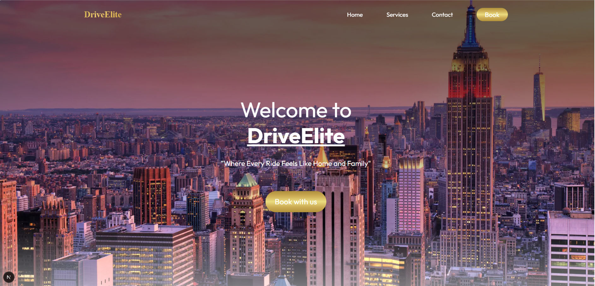
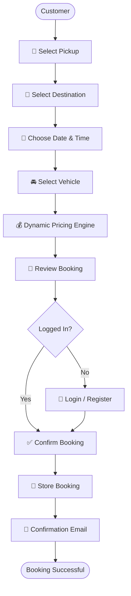
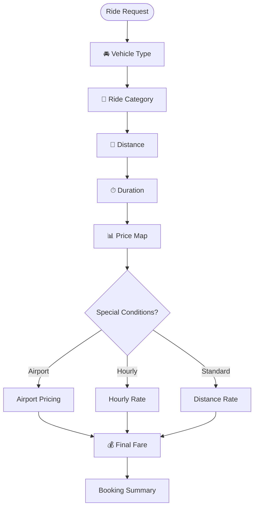
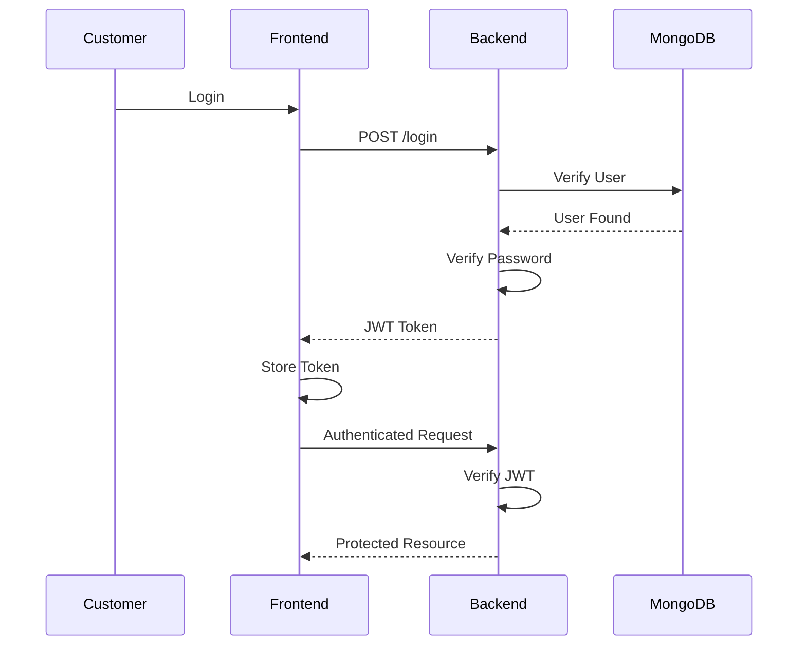
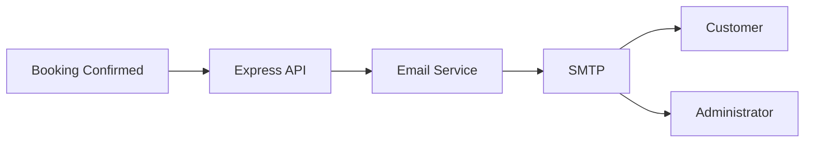
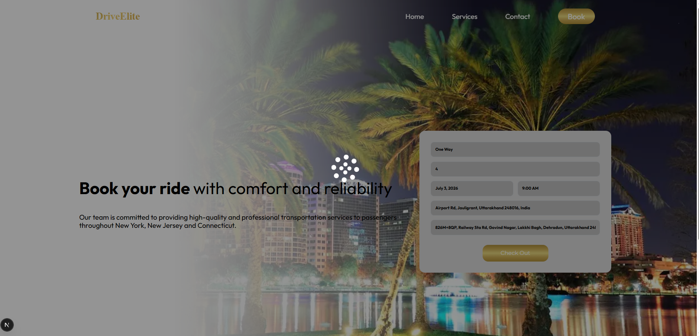
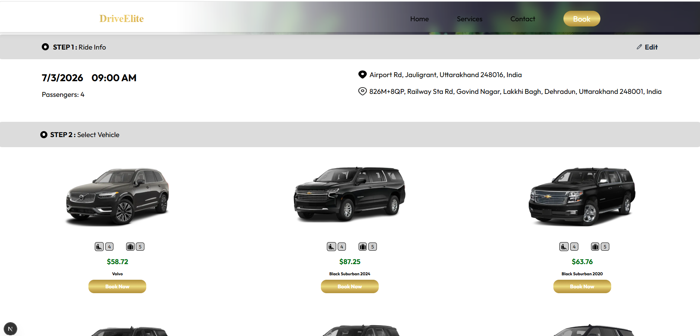
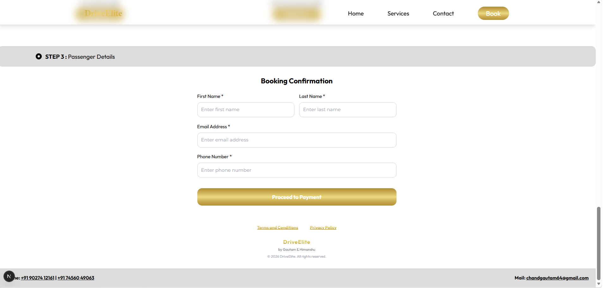
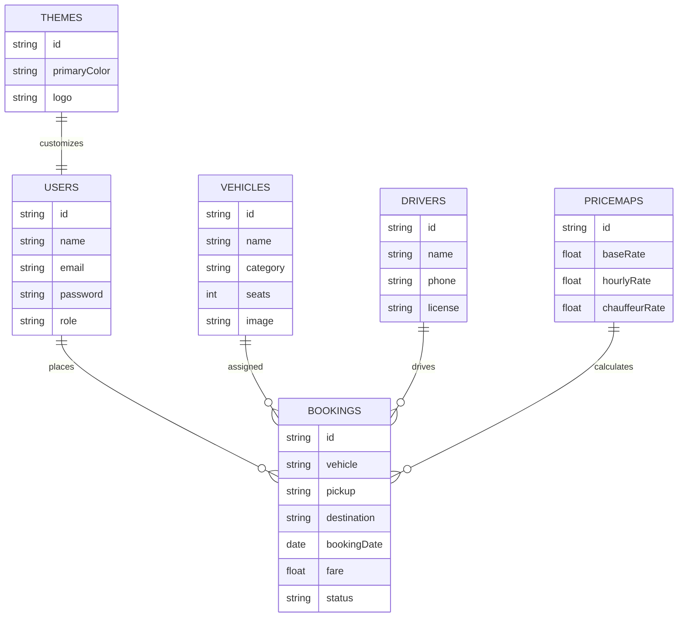
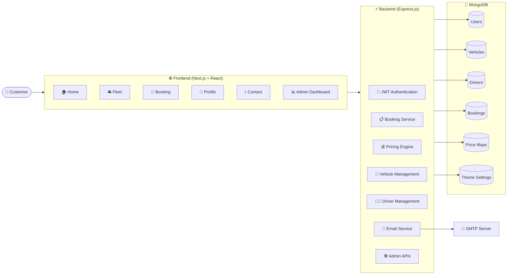

# DriveElite
<div align="center">

### **Premium Luxury Transportation & Chauffeur Booking Platform**

*A modern full-stack web application for booking premium chauffeur-driven transportation with dynamic pricing, secure authentication, and comprehensive fleet management.*

---


---

**DriveElite** is a production-style luxury transportation platform designed for premium chauffeur services. The platform enables customers to book rides, receive real-time price estimates, explore an exclusive fleet, and manage reservations through a responsive and intuitive interface. Administrators can manage bookings, vehicles, pricing, drivers, and customer information through a secure dashboard.

</div>

---

# :) Table of Contents

* Overview
* Key Features
* Technology Stack
* System Architecture
* Project Structure
* Booking Workflow
* Pricing Engine
* Authentication & Security
* Database Design
* Screenshots
* Installation
* Environment Variables
* Running the Application
* API Documentation
* Deployment
* Future Enhancements
* Contributing
* License

---

# :) Overview

DriveElite was developed as a modern transportation management platform capable of handling the complete lifecycle of premium ride reservations.

The project demonstrates full-stack development practices including secure authentication, REST API development, database design, responsive frontend development, pricing logic, email integration, and administrative management.

The system separates customer-facing functionality from administrative operations while maintaining a scalable backend architecture suitable for production environments.

---

# :) Key Features

## Customer Features

* Premium vehicle browsing
* Instant booking experience
* Dynamic fare estimation
* Airport transfer booking
* Hourly chauffeur services
* Reservation management
* Responsive mobile interface
* Contact & support system
* Secure authentication
* Profile management

---

## Admin Features

* Secure administrator login
* Dashboard analytics
* Booking management
* Vehicle management
* Driver management
* Customer management
* Pricing configuration
* Theme customization
* Email management
* Database seeding utilities

---

## Booking System

* One-way rides
* Round-trip bookings
* Hourly reservations
* Airport transfers
* Date & time scheduling
* Passenger information
* Vehicle selection
* Booking confirmation

---

## Booking Workflow


## Dynamic Pricing Engine

The pricing engine calculates fares based on multiple business rules instead of fixed values.

Pricing considers:

* Vehicle category
* Ride type
* Distance
* Hourly bookings
* Chauffeur services
* Configurable pricing maps
* Administrative pricing rules

This architecture allows business administrators to update prices without modifying application code.

---
##  Dynamic Pricing Engine


## Authentication

* JWT Authentication
* Password hashing
* Protected routes
* Admin authorization
* User sessions
* Secure API access

---
## Authentication Flow


## Email Services

Integrated email functionality provides:

* Booking confirmations
* Customer inquiries
* Contact form notifications
* Administrative alerts

---
## Email Notification Service


# Screenshots

# Booking Page


---
# Car Lists


--
# Confirmation Page


--
# :) Technology Stack

## Frontend

* Next.js
* React
* TypeScript
* Tailwind CSS
* Axios
* React Icons

---

## Backend

* Node.js
* Express.js
* JWT
* bcrypt
* Nodemailer
* REST APIs

---

## Database

* MongoDB
* Mongoose ODM

---
## Database Design



## Development Tools

* Git
* GitHub
* VS Code
* ESLint
* npm

---

# :) Architecture



# :) Project Structure

```text
DriveElite
│
├── components/
├── pages/
├── public/
├── styles/
├── server/
│   ├── controllers/
│   ├── models/
│   ├── routes/
│   ├── middleware/
│   ├── utils/
│   └── seed.js
│
├── docs/
├── .env.example
├── package.json
└── README.md
```

---

# :) High-Level Workflow

```text
Customer

      │

      ▼

Select Ride

      │

      ▼

Choose Vehicle

      │

      ▼

Pricing Engine

      │

      ▼

Booking Confirmation

      │

      ▼

Database Storage

      │

      ▼

Confirmation Email

      │

      ▼

Admin Dashboard
```

## Future Improvements

- Real-time vehicle tracking
- AI-powered vehicle recommendations
- Razorpay/Stripe payment integration
- Email and SMS booking notifications
- Admin analytics dashboard
- Docker deployment
- Cloud deployment on AWS
